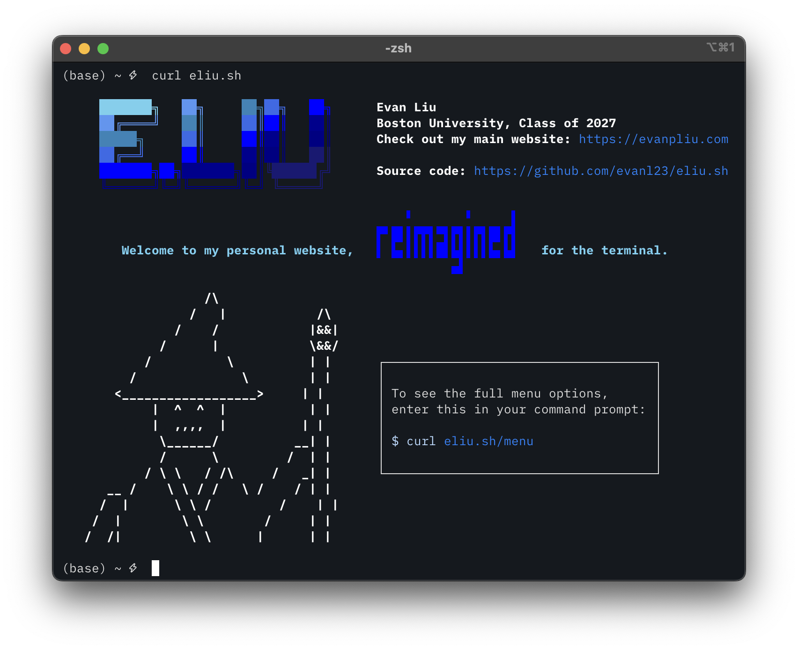

# eliu.sh
### Introducing the all new, the all colorful...



My personal website, reimagined for your terminal. 

To view the site, simply run:
```bash
curl eliu.sh
```


## Requirements
The user terminal must support true color (24-bit), else colors will not be rendered correctly. 

## Acknowledgements
Credit is due to [YSAP](https://ysap.sh) for the inspiration and code for the [tools](https://github.com/bahamas10/ysap/tree/main/website/tools) directory.
